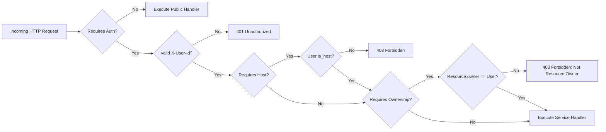
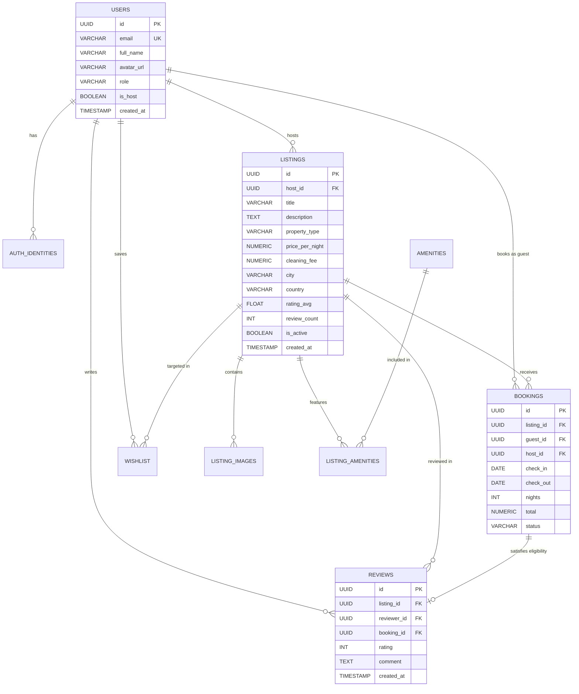
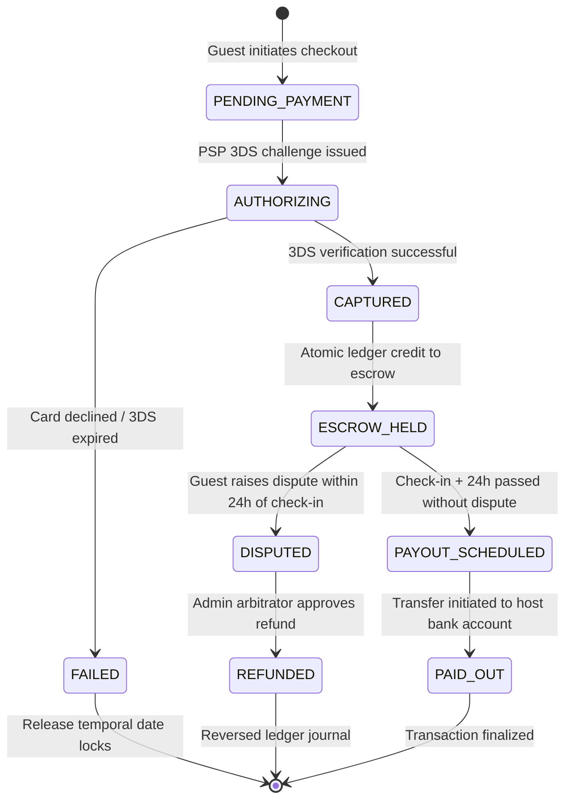

# Airbnb Marketplace

A production-grade, full-stack Airbnb-inspired marketplace built with **Next.js 15 (App Router)** and a **FastAPI** backend backed by **Supabase PostgreSQL** via **SQLAlchemy**, featuring an embedded **AI Assistant**.

> **Quick Setup**: For local environment setup, dependency installation, database seeding, and running the services, please see [SETUP.md](SETUP.md).

---

## 🏛️ System Architecture

The application adopts a **Layered Architecture** with strict separation of concerns, decoupling the presentation layer, REST API interface, domain business logic, AI assistant subsystem, and database persistence.


---

## 📐 API Design & Architectural Layers

The backend is structured into distinct, decoupled tiers:

```
backend/app/
├── api/routes/          # HTTP transport layer (FastAPI routers, endpoint definitions)
├── routers/             # Specialized service routers (e.g. chat.py for Gemini AI)
├── core/                # Global configurations, settings, and auth dependencies
├── db/                  # Engine, session factories, and declarative base
├── models/              # SQLAlchemy ORM database models
├── repositories/        # Data access layer, SQL queries, and ORM projections
├── schemas/             # Pydantic v2 schemas for request validation & response serialization
└── services/            # Domain services encapsulating business rules
```

### 1. Transport Layer (`app/api/routes/` & `app/routers/`)
- Handles HTTP requests, parameter validation (path, query, body), and HTTP status code formatting.
- Injects dependencies such as database sessions (`get_db`) and authorization guards (`require_auth`, `require_host`).
- Completely decoupled from direct database access.

### 2. Service Layer (`app/services/`)
- Encapsulates multi-step transactions and cross-cutting domain logic.
- Enforces complex business constraints (e.g., verifying guest eligibility before writing a review, triggering rating recalculations, and computing night totals).

### 3. Repository Layer (`app/repositories/`)
- Isolates all SQLAlchemy queries, filters, joins, and manual relation loading.
- Prevents database leaks into router handlers.
- Implements efficient manual joins for related models (`ListingImage`, `Amenity`, `User`, `Review`).

### 4. Data Validation Layer (`app/schemas/`)
- Built with **Pydantic v2** (`BaseModel`, `ConfigDict(from_attributes=True)`).
- Strict type validation prevents injection, malformed payloads, or field exposure.

---

## 🔒 Security & Authorization Model

The API implements a robust **Role-Based Access Control (RBAC)** and resource-ownership validation matrix:



### Authorization Rules Matrix

| Endpoint Group | Route / Method | Access Level | Authorization Constraint |
| :--- | :--- | :--- | :--- |
| **Listings** | `GET /api/listings` | Public | Only active listings returned (newest first) |
| **Listings** | `GET /api/listings/{id}` | Public | Detailed view with host, photos & amenities |
| **Listings** | `POST /api/listings` | Host Only | User must have `is_host=True` |
| **Listings** | `PUT /api/listings/{id}` | Host Owner | Must be host AND `listing.host_id == user.id` |
| **Listings** | `DELETE /api/listings/{id}` | Host Owner | Soft delete / deactivation by owner |
| **Bookings** | `POST /api/bookings` | Authenticated | Guest cannot book their own listing |
| **Bookings** | `GET /api/bookings/my-trips`| Authenticated | Strictly scoped to `guest_id == user.id` |
| **Bookings** | `GET /api/bookings/{id}` | Authenticated | Restricted to booking `guest_id` OR listing `host_id` |
| **Bookings** | `PATCH /api/bookings/{id}/cancel` | Guest Only | Only the booking guest can cancel |
| **Reviews** | `POST /api/listings/{id}/reviews`| Authenticated | Must have `completed` booking; 1 review per booking |
| **Wishlist** | `ALL /api/wishlist/*` | Authenticated | Strictly scoped to `user_id == current_user.id` |
| **Host Portal**| `ALL /api/host/*` | Host Only | User must have `is_host=True`; scoped to host ID |
| **AI Chat** | `POST /api/chat` | Public / Optional Auth | Personalized if authenticated; context-aware RAG |

---

## 📋 Comprehensive API Specification

### 1. Authentication (`/api/auth`)
| Method | Endpoint | Description | Auth Required |
| :--- | :--- | :--- | :--- |
| `POST` | `/api/auth/signup` | Register new user account (guest or host) | No |
| `POST` | `/api/auth/login` | Login via email with user session retrieval | No |
| `GET` | `/api/auth/me` | Fetch authenticated user profile & role | `require_auth` |
| `POST` | `/api/auth/become-host` | Instant 1-click host privilege upgrade | `require_auth` |
| `GET` | `/api/auth/demo-users` | Fetch available seeded demo accounts | No |

### 2. Listings & Availability (`/api`)
| Method | Endpoint | Query / Body Params | Auth Required |
| :--- | :--- | :--- | :--- |
| `GET` | `/api/listings` | `city`, `check_in`, `check_out`, `guests`, `min_price`, `max_price`, `property_type`, `page`, `limit` | No |
| `GET` | `/api/listings/{id}` | Path: `id` (UUID) | No |
| `GET` | `/api/listings/{id}/availability`| Path: `id` (Returns blocked 90-day date ranges) | No |
| `GET` | `/api/amenities` | Fetches full amenity catalog | No |
| `POST` | `/api/listings` | Body: `ListingCreate` (title, price, amenities, images) | `require_host` |
| `PUT` | `/api/listings/{id}` | Body: `ListingUpdate` (partial updates) | `require_host` (Owner) |
| `DELETE`| `/api/listings/{id}` | Path: `id` (Soft deactivates listing) | `require_host` (Owner) |

### 3. Bookings (`/api/bookings`)
| Method | Endpoint | Description | Auth Required |
| :--- | :--- | :--- | :--- |
| `POST` | `/api/bookings` | Creates a booking; calculates nights, service fee, and total | `require_auth` (Non-Host) |
| `GET` | `/api/bookings/my-trips` | Returns all trips booked by the authenticated guest | `require_auth` |
| `GET` | `/api/bookings/{id}` | Retrieves booking detail with listing summary | `require_auth` (Party) |
| `PATCH`| `/api/bookings/{id}/confirm`| Confirms a pending reservation | `require_auth` (Party) |
| `PATCH`| `/api/bookings/{id}/cancel` | Cancels an existing reservation | `require_auth` (Guest) |

### 4. Reviews (`/api`)
| Method | Endpoint | Description | Auth Required |
| :--- | :--- | :--- | :--- |
| `GET` | `/api/listings/{id}/reviews` | Paginated reviews for a listing | No |
| `GET` | `/api/reviews?listing_id={id}`| Query-param based review feed | No |
| `POST`| `/api/listings/{id}/reviews` | Submits a review (1-5 stars + text comment) | `require_auth` (Eligible) |

> **Automated Rating Recomputation**: When a review is posted, the service calculates the new `AVG(rating)` and `COUNT(*)` in an atomic transaction and updates the `listings` table.

### 5. Wishlist (`/api/wishlist`)
| Method | Endpoint | Description | Auth Required |
| :--- | :--- | :--- | :--- |
| `GET` | `/api/wishlist` | Returns full listing cards saved by user | `require_auth` |
| `GET` | `/api/wishlist/ids` | Fast listing ID lookup for heart icon toggle states | `require_auth` |
| `POST` | `/api/wishlist/{listing_id}`| Adds listing to wishlist (idempotent) | `require_auth` |
| `DELETE`| `/api/wishlist/{listing_id}`| Removes listing from wishlist | `require_auth` |

### 6. Host Dashboard (`/api/host`)
| Method | Endpoint | Description | Auth Required |
| :--- | :--- | :--- | :--- |
| `GET` | `/api/host/listings` | List of properties owned by the host + booking counts | `require_host` |
| `GET` | `/api/host/bookings` | Reservations across all host properties with guest details | `require_host` |
| `GET` | `/api/host/stats` | Analytics: total earnings, reservation count, listing count | `require_host` |

### 7. StayFinder AI Assistant (`/api/chat`)
| Method | Endpoint | Description | Auth Required |
| :--- | :--- | :--- | :--- |
| `POST` | `/api/chat` | Context-aware AI assistant querying PostgreSQL + Gemini 1.5 Flash | Optional (Personalizes if logged in) |

**Request Payload**:
```json
{
  "message": "Find me a beach villa in Goa under ₹15000",
  "listing_id": null,
  "city": "Goa",
  "page_context": "explore"
}
```

**Response Payload**:
```json
{
  "reply": "Here are top-rated properties matching your search:\n\n• Villa in Goa in Goa for ₹10,000/night...\nClick any listing card below to view details and book.",
  "suggested_listings": [
    {
      "id": "587d8020-06c6-48b2-a0ef-4ade67785f9b",
      "title": "Villa in Goa",
      "city": "Goa",
      "price_per_night": 10000.0,
      "rating_avg": 4.9,
      "cover_image_url": "https://images.unsplash.com/..."
    }
  ]
}
```

---

## 🗄️ Database Entity-Relationship (ER) Model



---

## 💳 Out-of-Scope & Future Roadmap: Payment Gateway Microservice

In high-scale marketplace production environments, handling monetary transactions within the monolithic API presents severe compliance, security, and scalability bottlenecks. Payment processing and financial ledgers must be decoupled into an isolated, hardened **Payment Gateway Microservice**.

### 1. High-Level Distributed Architecture

```mermaid
flowchart TD
    subgraph ClientLayer["Client Layer"]
        Browser["Next.js Checkout Page\n(/checkout/[id])"]
    end

    subgraph CoreMarketplace["Core Marketplace Backend (FastAPI)"]
        BookingAPI["Booking Service\n(Domain Entity & Temporal Date Locks)"]
        BookingDB[("PostgreSQL Bookings DB\n(Status: pending_payment)")]
    end

    subgraph PaymentMicroservice["Payment Gateway Microservice (Isolated VPC / PCI Zone)"]
        PayAPI["Payment Gateway Engine\n(High-Throughput Go / FastAPI)"]
        IdempotencyStore[("Redis Cluster\n(Distributed Redlock & Idempotency Keys)")]
        LedgerDB[("Immutable Financial Ledger DB\n(Double-entry Bookkeeping)")]
        OutboxTable[("Transactional Outbox\n(Atomic DB Commit)")]
        OutboxRelay["Outbox CDC / Relay Worker\n(Debezium / Poller)"]
        WebhookWorker["Webhook Ingestion Worker\n(HMAC-SHA256 Verification & DLQ)"]
    end

    subgraph ExternalGateways["Payment Service Providers (PSP)"]
        Stripe["Stripe Connect / Razorpay Route\n(Escrow Vaults & 3DS Authentication)"]
    end

    subgraph EventStream["Distributed Message Broker"]
        Kafka["Apache Kafka / RabbitMQ\nTopics: payment.succeeded, payment.failed, escrow.released"]
    end

    subgraph DownstreamConsumers["Downstream Microservices"]
        NotificationService["Notification Worker\n(Email Invoice & Push Alert)"]
        HostPayoutEngine["Host Payout Scheduler\n(Escrow Release at Check-in + 24h)"]
    end

    Browser -->|1. Initiate Checkout| BookingAPI
    BookingAPI -->|2. Create Payment Intent Request| PayAPI
    PayAPI -->|3. Acquire Distributed Lock and Check Idempotency| IdempotencyStore
    PayAPI -->|4. Create Order or Intent with Escrow Metadata| Stripe
    Stripe -->|5. Client Secret and SDK Ephemeral Key| Browser
    Browser -->|6. Submit 3D-Secure Biometrics or OTP| Stripe
    Stripe -->|7. Async Server-to-Server Webhook| WebhookWorker
    WebhookWorker -->|8. Verify HMAC Signature and Parse Event| WebhookWorker
    WebhookWorker -->|9. Write Double-entry Journal and Outbox| LedgerDB
    LedgerDB -.->|Atomic Insert| OutboxTable
    OutboxTable -->|10. Stream Committed Records| OutboxRelay
    OutboxRelay -->|11. Publish payment.succeeded Event| Kafka
    Kafka -->|12. Consume Event: Confirm Booking| BookingAPI
    BookingAPI -->|Update Status| BookingDB
    Kafka -->|13. Trigger Customer Confirmation Email| NotificationService
    Kafka -->|14. Schedule Payout Release at Check-in| HostPayoutEngine
```



---

### 2. Core Architectural Principles

#### A. PCI-DSS Level 1 Compliance Isolation
* **Zero PAN Exposure**: Neither the core marketplace database nor its application logs ever touch Primary Account Numbers (PAN), CVVs, or cardholder credentials.
* **Network Segmentation**: The payment microservice lives inside a hardened private Virtual Private Cloud (VPC) with egress filtering, mutual TLS (mTLS) authentication, and strict IP allowlists for PSP endpoints.

#### B. Distributed Idempotency & Concurrency Control
* **Idempotency Key Protocol**: Every checkout request requires a client-supplied or gateway-generated `Idempotency-Key` header.
* **Atomic Redis Locks**: A Redis lock (`SET lock:<idempotency_key> <uuid> NX PX 30000`) prevents concurrent duplicate charge executions caused by rapid multi-clicks or network retries.
* **Cached Deterministic Responses**: Once a payment intent transitions to an end state (`succeeded`, `failed`), the completed payload is cached with a 24-hour TTL, ensuring subsequent identical requests receive identical responses without re-charging.

#### C. Transactional Outbox Pattern (Zero Message Loss)
To eliminate dual-write hazards between relational database commits and asynchronous message publishing (Kafka):
1. When a payment event succeeds, the ledger update and an outbox event record are committed inside a **single ACID transaction** in PostgreSQL:
   ```sql
   BEGIN;
   INSERT INTO ledger_entries (entry_id, account_id, amount, direction) VALUES (...);
   INSERT INTO transactional_outbox (event_id, event_type, payload, status) 
   VALUES (gen_random_uuid(), 'payment.succeeded', '{"booking_id": "...", "amount": 10000}', 'PENDING');
   COMMIT;
   ```
2. A lightweight outbox polling daemon (or Debezium CDC via PostgreSQL write-ahead log) streams the events to Kafka with **at-least-once delivery guarantees**.

#### D. Double-Entry Immutable Accounting Ledger
All financial movements follow strict double-entry bookkeeping ($Total\ Debits = Total\ Credits$). Accounts are immutable; adjustments require reversing offset transactions:

| Transaction Step | Debit Account | Credit Account | Amount | Description |
| :--- | :--- | :--- | :--- | :--- |
| **Guest Payment Captured** | `Cash/Stripe Clearing` | `Guest Funds Escrow` | ₹11,200 | Full charge collected from guest |
| **Platform Commission Recognized**| `Guest Funds Escrow` | `Marketplace Service Revenue`| ₹1,200 | 12% platform fee |
| **Host Escrow Allocated** | `Guest Funds Escrow` | `Host Pending Payable` | ₹10,000 | Nightly rate + cleaning fee held for host |
| **Post Check-in Host Disbursement**| `Host Pending Payable` | `Cash/Stripe Clearing` | ₹10,000 | Direct bank transfer to host (Check-in + 24h) |

#### E. Marketplace Escrow & Split Payout Mechanism
* **Escrow Holding**: Guest funds remain vaulted in the marketplace escrow balance during the interim period between booking confirmation and guest arrival.
* **Disbursement Safety Gate**: Host payouts are held until $24\text{ hours}$ after successful guest check-in. If the guest raises a critical accommodation dispute (e.g. key handover failure, misrepresented property), payout disbursement is paused automatically pending arbitration.
* **PSP Connected Accounts**: Host onboarding utilizes **Stripe Connect Custom/Express** or **Razorpay Route**, enabling automated tax form generation (1099-K) and Know Your Customer (KYC) regulatory compliance.

---

### 3. Payment & Booking Lifecycle State Machine



---

### 4. Microservice API Interface Contracts

#### `POST /v1/payments/intents`
Creates or retrieves a payment intent and returns the client secret for PSP front-end SDKs.
```json
// Request Body
{
  "booking_id": "7c186007-9a62-4641-85f7-95b8082afeb7",
  "guest_id": "93b2a09c-c9d3-4fbc-b40b-4654b9cb7462",
  "host_id": "550e8400-e29b-41d4-a716-446655440000",
  "currency": "INR",
  "amount_subtotal": 1000000,
  "amount_cleaning_fee": 150000,
  "amount_service_fee": 138000,
  "total_amount": 1288000
}

// Response Body (201 Created)
{
  "payment_intent_id": "pi_3NskL2K0eL23xL1q2p89x",
  "client_secret": "pi_3NskL2K0eL23xL1q2p89x_secret_AbCdEf123",
  "status": "requires_payment_method",
  "escrow_release_date": "2026-10-15T15:00:00Z"
}
```

#### `POST /v1/webhooks/{provider}`
Secure asynchronous webhook ingestion endpoint.
* Validates provider signature (e.g. `Stripe-Signature` or `X-Razorpay-Signature` via HMAC-SHA256).
* Enqueues verified payloads into RabbitMQ / Kafka with dead-letter queue (DLQ) retry policies (exponential backoff with jitter: $2^n + \text{rand}(0, 1)$ seconds).

---

### 5. Current Implementation Note
> **Simulated Financial Flow**:
> In this repository's reference implementation, the checkout process simulates the authorization and settlement flow with 100% mathematical integrity by a simple formula.
> Upon clicking **"Confirm & Pay"**, the reservation atomically commits to `status = confirmed`, generates a persistent booking record, and links directly to the guest's **Trips** dashboard.

---

## ⚡ Key Architectural Highlights

1. **Deterministic PostgreSQL Pagination**:
   Search queries use secondary tie-breakers (`ORDER BY created_at DESC, id ASC`) ensuring that pagination (`OFFSET / LIMIT`) is 100% stable without duplicate items across page loads.

2. **Real-Time Context-Aware AI (RAG)**:
   The chatbot executes dynamic database queries against active listings and passes factual context to Gemini 1.5 Flash, preventing hallucinated property recommendations.

3. **SSR Hydration Safety**:
   Next.js 15 Client Components utilize a strict `mounted` guard and post-hydration session recovery, eliminating HTML mismatch warnings between server SSR and client browser hydration.

4. **Self-Healing Auth**:
   If credentials stored in the browser's `localStorage` become stale or invalid against the database, the authentication context automatically purges stale records and prompts cleanly for re-authentication.

