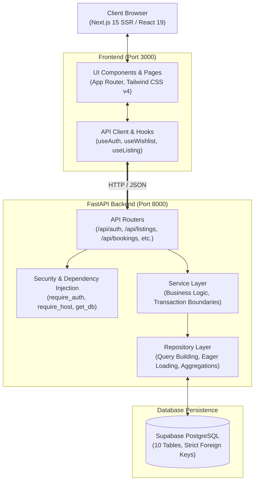
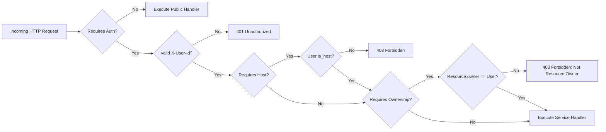
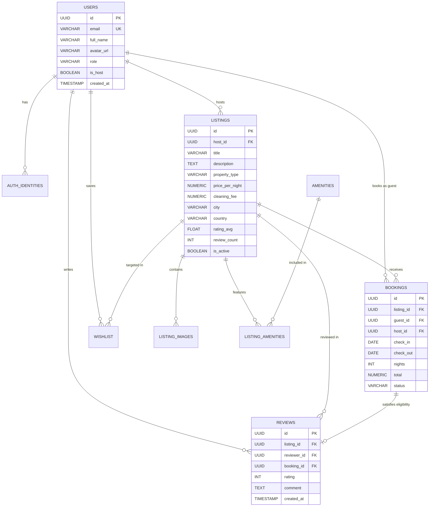

# Airbnb Marketplace

A production-grade, full-stack Airbnb-inspired marketplace built with **Next.js 15 (App Router)** and a **FastAPI** backend backed by **Supabase PostgreSQL** via **SQLAlchemy**.

> **Quick Setup**: For local environment setup, dependency installation, database seeding, and running the services, please see [SETUP.md](SETUP.md).

---

## 🏛️ System Architecture

The application adopts a **Layered Architecture** with strict separation of concerns, decoupling the presentation layer, REST API interface, domain business logic, and database persistence.



---

## 📐 API Design & Architectural Layers

The backend is structured into distinct, decoupled tiers:

```
backend/app/
├── api/routes/          # HTTP transport layer (FastAPI routers, endpoint definitions)
├── core/                # Global configurations, settings, and auth dependencies
├── db/                  # Engine, session factories, and declarative base
├── models/              # SQLAlchemy ORM database models
├── repositories/        # Data access layer, SQL queries, and ORM projections
├── schemas/             # Pydantic v2 schemas for request validation & response serialization
└── services/            # Domain services encapsulating business rules
```

### 1. Transport Layer (`app/api/routes/`)
- Handles HTTP requests, parameter validation (path, query, body), and HTTP status code formatting.
- Injects dependencies such as database sessions (`get_db`) and authorization guards (`require_auth`, `require_host`).
- Completely decoupled from direct database access.

### 2. Service Layer (`app/services/`)
- Encapsulates multi-step transactions and cross-cutting domain logic.
- Enforces complex business constraints (e.g., verifying guest eligibility before writing a review, triggering rating recalculations, and computing night totals).

### 3. Repository Layer (`app/repositories/`)
- Isolate all SQLAlchemy queries, filters, joins, and manual relation loading.
- Prevents database leaks into router handlers.
- Implements efficient manual joins for related models (`ListingImage`, `Amenity`, `User`, `Review`).

### 4. Data Validation Layer (`app/schemas/`)
- Built with **Pydantic v2** (`BaseModel`, `ConfigDict(from_attributes=True)`).
- Strict type validation prevents injection, malformed payloads, or field exposure.

---

## 🔒 Security & Authorization Model

The API implements a robust **Role-Based Access Control (RBAC)** and resource-ownership validation matrix:



### Authorization Rules Matrix

| Endpoint Group | Route / Method | Access Level | Authorization Constraint |
| :--- | :--- | :--- | :--- |
| **Listings** | `GET /api/listings` | Public | Only active listings returned |
| **Listings** | `GET /api/listings/{id}` | Public | Detailed view with host & amenities |
| **Listings** | `POST /api/listings` | Host Only | User must have `is_host=True` |
| **Listings** | `PUT /api/listings/{id}` | Host Owner | Must be host AND `listing.host_id == user.id` |
| **Listings** | `DELETE /api/listings/{id}` | Host Owner | Soft delete / deactivation by owner |
| **Bookings** | `POST /api/bookings` | Authenticated | Guest cannot book their own listing |
| **Bookings** | `GET /api/bookings/my-trips`| Authenticated | Strictly scoped to `guest_id == user.id` |
| **Bookings** | `GET /api/bookings/{id}` | Authenticated | Restricted to booking `guest_id` OR listing `host_id` |
| **Bookings** | `PATCH /api/bookings/{id}/cancel` | Guest Only | Only the booking guest can cancel |
| **Reviews** | `POST /api/listings/{id}/reviews`| Authenticated | Must have `completed` booking; 1 review per booking |
| **Wishlist** | `ALL /api/wishlist/*` | Authenticated | Strictly scoped to `user_id == current_user.id` |
| **Host Portal**| `ALL /api/host/*` | Host Only | User must have `is_host=True`; scoped to host ID |

---

## 📋 Comprehensive API Specification

### 1. Authentication (`/api/auth`)
| Method | Endpoint | Description | Auth Required |
| :--- | :--- | :--- | :--- |
| `POST` | `/api/auth/signup` | Register new user account (guest or host) | No |
| `POST` | `/api/auth/login` | Login via email with user session retrieval | No |
| `GET` | `/api/auth/me` | Fetch authenticated user profile & role | `require_auth` |
| `POST` | `/api/auth/become-host` | Instant 1-click host privilege upgrade | `require_auth` |
| `GET` | `/api/auth/demo-users` | Fetch available seeded demo accounts | No |

### 2. Listings & Availability (`/api`)
| Method | Endpoint | Query / Body Params | Auth Required |
| :--- | :--- | :--- | :--- |
| `GET` | `/api/listings` | `city`, `check_in`, `check_out`, `guests`, `min_price`, `max_price`, `property_type`, `page`, `limit` | No |
| `GET` | `/api/listings/{id}` | Path: `id` (UUID) | No |
| `GET` | `/api/listings/{id}/availability`| Path: `id` (Returns blocked 90-day date ranges) | No |
| `GET` | `/api/amenities` | Fetches full amenity catalog | No |
| `POST` | `/api/listings` | Body: `ListingCreate` (title, price, amenities, images) | `require_host` |
| `PUT` | `/api/listings/{id}` | Body: `ListingUpdate` (partial updates) | `require_host` (Owner) |
| `DELETE`| `/api/listings/{id}` | Path: `id` (Soft deactivates listing) | `require_host` (Owner) |

### 3. Bookings (`/api/bookings`)
| Method | Endpoint | Description | Auth Required |
| :--- | :--- | :--- | :--- |
| `POST` | `/api/bookings` | Creates a booking; calculates nights, service fee, and total | `require_auth` (Non-Host) |
| `GET` | `/api/bookings/my-trips` | Returns all trips booked by the authenticated guest | `require_auth` |
| `GET` | `/api/bookings/{id}` | Retrieves booking detail with listing summary | `require_auth` (Party) |
| `PATCH`| `/api/bookings/{id}/confirm`| Confirms a pending reservation | `require_auth` (Party) |
| `PATCH`| `/api/bookings/{id}/cancel` | Cancels an existing reservation | `require_auth` (Guest) |

### 4. Reviews (`/api`)
| Method | Endpoint | Description | Auth Required |
| :--- | :--- | :--- | :--- |
| `GET` | `/api/listings/{id}/reviews` | Paginated reviews for a listing | No |
| `GET` | `/api/reviews?listing_id={id}`| Query-param based review feed | No |
| `POST`| `/api/listings/{id}/reviews` | Submits a review (1-5 stars + text comment) | `require_auth` (Eligible) |

> **Automated Rating Recomputation**: When a review is posted, the service calculates the new `AVG(rating)` and `COUNT(*)` in an atomic transaction and updates the `listings` table.

### 5. Wishlist (`/api/wishlist`)
| Method | Endpoint | Description | Auth Required |
| :--- | :--- | :--- | :--- |
| `GET` | `/api/wishlist` | Returns full listing cards saved by user | `require_auth` |
| `GET` | `/api/wishlist/ids` | Fast listing ID lookup for heart icon toggle states | `require_auth` |
| `POST` | `/api/wishlist/{listing_id}`| Adds listing to wishlist (idempotent) | `require_auth` |
| `DELETE`| `/api/wishlist/{listing_id}`| Removes listing from wishlist | `require_auth` |

### 6. Host Dashboard (`/api/host`)
| Method | Endpoint | Description | Auth Required |
| :--- | :--- | :--- | :--- |
| `GET` | `/api/host/listings` | List of properties owned by the host + booking counts | `require_host` |
| `GET` | `/api/host/bookings` | Reservations across all host properties with guest details | `require_host` |
| `GET` | `/api/host/stats` | Analytics: total earnings, reservation count, listing count | `require_host` |

---

## 🗄️ Database Entity-Relationship (ER) Model



---

## ⚡ Key Architectural Highlights

1. **Date Overlap Prevention**:
   Search filters exclude listings that have overlapping `confirmed` or `pending` reservations:
   $$\text{Existing Booking Check-In} < \text{Requested Check-Out} \quad \land \quad \text{Existing Booking Check-Out} > \text{Requested Check-In}$$

2. **SSR Hydration Safety**:
   Next.js 15 Client Components use a strict `mounted` guard and post-hydration session recovery to guarantee zero HTML mismatch warnings between server SSR and client browser hydration.

3. **CORS & Resilience**:
   Cross-Origin Resource Sharing is configured to support both local web development (`localhost:3000`) and arbitrary origins with credentials enabled.

4. **Self-Healing Auth**:
   If credentials stored in the browser's `localStorage` become stale or invalid against the database, the authentication context automatically purges stale records and prompts cleanly for re-authentication.
